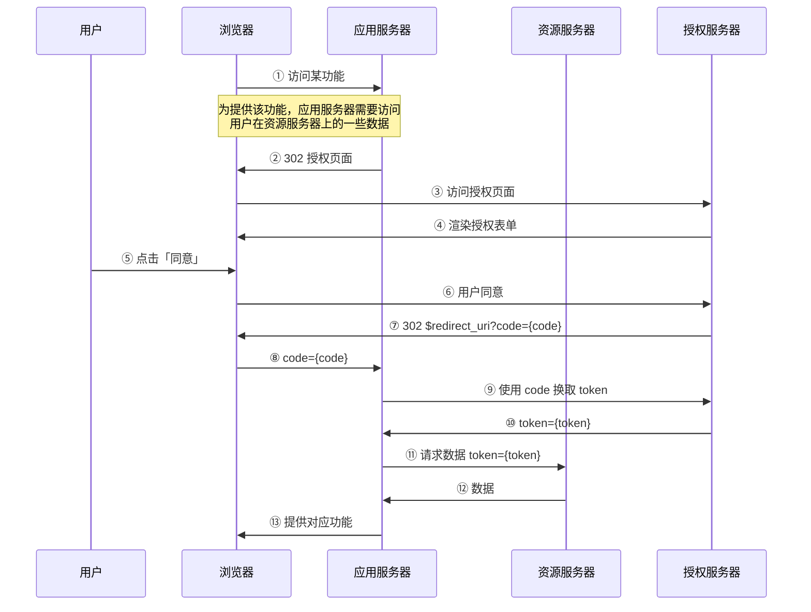
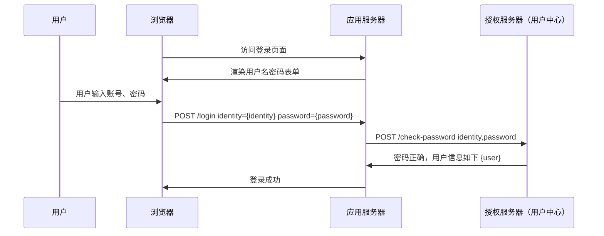
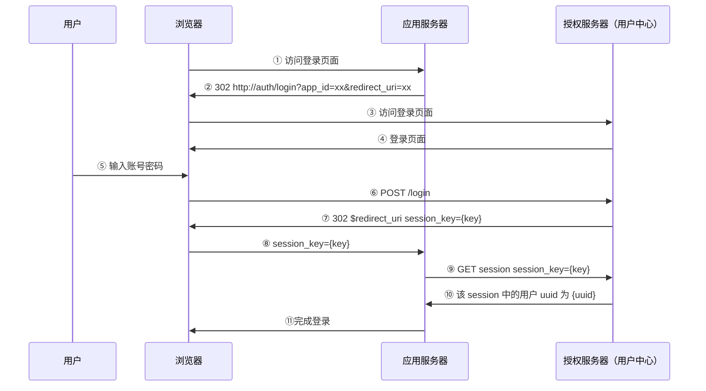

# natureself-edc

# 授权中心

## 背景介绍

本服务实际承担两大角色：

- 授权中心：使用 OAuth 协议，提供应用间授权访问机制
- 用户中心：为应用提供统一的用户表、中心化的用户信息存储，以及登录流程

我们的产品非常多，目前初步决定将产品分类，每一类称之为一个 stack，我们在每个 stack 中部署一个授权中心服务，授权服务的代码完全相同（从而降低维护成本）。
将来，stack 的组成可能会根据实际情况进行调整。

目前我们有以下 Stack：

- 中日项目：stack 名称为 `zrpf`，包含所有交付给中日项目的产品
- 普普医生：stack 名称为 `drpp`，包含所有普普医生的产品
- 基层联盟：stack 名称为 `cardpc`，包含所有基层联盟的网站和项目（如 PCCM、星巴克项目、京东健康项目、培训平台等等）
- 医咖会：stack 名称为 `medieco`，包含医咖会网站以及医咖会衍生项目（如慢阻肺项目、CDS 等）
- 临研室：stack 名称为 `einlab`，包含临研室所有产品

近期实际开始整合工作的 stack 主要为 `cardpc` 和 `zrpf`。

## 基本概念

在进一步理解授权中心的设计实现之前，我们需要先明确一些基本术语：

- 应用（Application）
- 用户（User）
- 服务器（Server）
- 客户端（Client）
- 令牌（Token）

### 应用

应用，可以是一个产品，例如「医咖会」是一个应用，也可能是一个项目，例如「基层规建申报系统（PCCM）」是一个项目，
一个应用包含一个或多个后端程序（例如医咖会有 legacy-server、medieco-next、server-v2、medieco 等 4 个后端组成），
同时也可以包含一个或多个前端程序（例如 PCCM 有用户端、管理后台、专家端，有些项目还会有微信小程序、移动 App 等）。
一个应用一般可以理解为一个功能完整的网站，有独立的数据库，有独立的用户表等等。

### 用户

用户，也可以称之为账号，是用户在我们的应用中注册的账号。在以前，每一个应用都有自己的用户表，因此都有自己的用户集合，
现在我们将这些应用的用户关联起来，例如我们认为各应用中手机号相同的账号，对应的是同一个用户。

### 服务器

服务器，简单的说就是提供 HTTP 接口的软件程序，通过这些接口，可以获取数据库中的特定数据，也可以对数据库中的数据进行操作。
我们目前公司的项目中，服务器有许多语言/框架实现，有 Python/Django、Python/FastAPI、Node/Koa、Java 等等。

### 客户端

客户端，广义上来说指用户使用的设备或软件程序，例如 Chrome 浏览器、微信浏览器、小程序等等。在我们这里，我们定义为我们的
某个前端，例如 pccm-webapp（PCCM 项目的 web 端）、starbucks-admin-webapp（星巴克项目的管理后台）等等，
其实，后端程序之间也会互相发请求，此时后端程序（例如 python 的 requests 库）也是客户端。因此，有一些（许多）后端程序，
即是服务器，同时也是客户端。

### 令牌

令牌，可以简单理解为授权的载体。我们可以讲个故事来帮助大家理解，例如前一阵子的电视剧「赘婿」中，秦相给宁毅一把匕首，
秦相的手下见此匕首如见其人，需要听其调遣。这里，这把匕首就是一个令牌，令牌是权限的载体，谁持有这个令牌，谁就拥有这把
匕首所承载的权限。如果宁毅丢失了这个匕首，其他人捡到了，那么捡到的人就会拥有同等的权限。除非秦相吊销这个令牌（声明
从此以后这把匕首不再具有权限）。

### 小结

以上是一些基础概念，接下来我们来看 HTTP 请求。通过上面的概念，我们知道，HTTP 请求一定是由客户端发送的，这个客户端可能是
一个前端网页，可能是小程序，可能是移动 App，也可能是某个后端程序。服务器在接收到请求时，需要判断发送这个请求的人是否有访问
这个接口的权限。在以前，我们主要处理的是浏览器发送给后端程序的请求，而浏览器中的请求基本都是由用户发出的，因此我们可以判断
这个用户是否有权限即可，那么我们如何知道发送这个请求的用户是谁呢？通过「登录」这一操作。

「登录」这件事，可以理解为这样两个步骤，authentication(authn) 和 authorization(authz)：

- 用户提供账号（identity）、密码（credential），服务器验证（authenticate）通过后
- 服务器生成一个令牌（token）发送给客户端，之后客户端发请求时，带上这个 token，服务器就知道是谁了。生成 token 的操作可以理解为授权（authorize）

Token 的形式可以比较多样，既可以把授权信息直接保存在 token 中（例如 JWT token 可以保存信息），也可以将信息
保存在数据库中，而把数据库中的 id 作为 token 使用（例如基于 Cookie Session 的方案中，`sessionid` 就可以当作是 token）。

## Token

前面我们了解了 Token 的基本概念。接下来我们深入理解 Token。无论 Token 是什么形式，一个 Token 应当包含以下信息（以伪代码的形式描述）：

```py
class Token:
    # 发送给用户的值（可能是一个随机字符串，可能是 jwt，也可能是其他形式，如 sessionid 的值）
    token: str

    # Token 是由谁签发的（谁签发，谁负责校验 Token 的真伪）
    issuer: str
    # Token 的受众是谁，我们后面会举例细看
    audience: str
    # Token 的主体，我们进一步分解为三个字段来描述
    # 主体类型只能为 user、app，分别表示主体是一个人或一个应用
    subject_type: "user" | "app"
    # 如果主体是 app，那么我们可以记录这个应用所属的机构。目前我们所有应用的 org 都是硬编码的 "natureself"
    subject_org: str
    # 主体的 id（总是转化成字符串存储），具体对应数据库中什么值，由应用自行决定
    # 例如由授权中心签发的 Token 中，用户的 subject_id 为 uuid，应用的 subject_id 为 app_id
    subject_id: str
    # Token 的有效期（Unix 时间戳）
    expire: int
    # Token 的权限。一个 Token 的权限可以等于主体的权限，也可以是主体权限的子集
    # 如果 scopes 为 None，则 Token 的权限等同于主体的权限，如果 scopes 不为空，则 Token 的权限由 scopes 决定，我们后面会举例
    scopes: List[str] | None
    # Token 还可以携带其他附加信息，具体含义由使用场景自行决定
    payload: dict | None
```

Token 中为何需要如此多的信息？我们从下面的流程中会逐渐理解。

先简单讲一讲 OAuth。OAuth 描述了一套授权框架（具体流程根据介质不同，会有一些差异，例如网页授权和移动 App 授权，流程上会有差异，主要是介质的安全特性不同），
但我们首先抛开介质的差别，先理解这个框架。

在授权中，会涉及到这些角色：

- Resource Owner，资源拥有者，在我们的场景中，就是用户（User）
- Resource Server，资源服务器，用户的资源保存在资源服务器中
- Authorization Server，认证服务器，也就是我们这里的授权中心
- ThirdParty Application，第三方应用，我们后面在描述时在无歧义的场合会简称为应用服务器
- User Agent，客户端，如浏览器，我们有时候也称为 Client

我们可以列举一些授权流程来分析，例如大家最熟悉的「微信网页授权」，例如医咖会使用微信登录，可以描述为

> 用户授权医咖会服务器访问其保存在微信服务器中的头像、昵称信息。

其中：

- Resource Owner：即当前的用户
- Resource Server：微信服务器（保存用户头像、昵称信息的服务器）
- Authorization Server：微信服务器（微信用于签发 Token 的服务器，它跟 Resource Server 可以是同一台服务器）
- ThirdParty Application：医咖会
- scope：snsapi_userinfo，表示允许访问用户的基本社交信息（头像、昵称、性别、城市、语言等）

接下来我们看一下在中日项目（以及我们其他 stack）中的场景。假设我们在一个 stack 中有 a、b、c ……等应用。我们看看常见都有哪些场景：

- a 应用的前端访问 a 应用的后端，这是应用内访问，是最简单的情形
- b 应用（假设为第一方应用）访问 a 应用后端的数据
- c 应用（假设为第三方应用）访问 a 应用后端的数据

三个请求都是发送给 a 应用的，他们肯定携带了不同的 Token，那么我们看看这些 Token 都长什么样，以及 a 应用如何鉴权。

在这个场景中，Token 只需要有以下几个字段即可（`expire`是基础字段，省略不讨论）：

```py
class Token:
    subject_type: "user" | "app"
    subject_id: str
    subject_org: str
```

上述三个请求携带的 Token 分别称之为 `token1`, `token2`, `token3`，则 3 个 token 的内容分别为：

- `token1 == Token(type="user", id="123")`
- `token2 == Token(type="app", id="b", org="natureself")`
- `token3 == Token(type="user", id="123")`

这些 Token 分别是如何来的？

- `token1`：用户登录 a 时，a 签发了 `token1`
- `token3`：c 要访问用户保存在 a 中的数据，必须经过用户授权（例如通过 OAuth 流程，用户点击「同意」按钮后），a 签发了 `token3`，我们可以看到，`token3` 跟 `token1` 完全相同
- `token2`：b 要访问用户保存在 a 中的数据，也必须经过用户授权，但如果在用户注册时，注册协议中就讲明所有内部应用可以直接访问所有数据，那么意味着用户已经授权过，就无需再让用户参与交互授权了。b 可以直接向 a 提出签发申请，a 即可签发 `token2`。

我们同时也注意到，`token2` 其实也可以使用 `Token(type="user", id="123")` ，但这意味着 b 请求 a 的接口时，需要申请许多 Token，分别以不同的用户身份去请求数据，这一方面很麻烦，另一方面也无法请求一些汇总性质的接口。而上述 `token2` 的形式，a 见到此 Token 后，通过 `org="natureself"` 可知是第一方应用，直接给予相应的权限。

接下来，我们发现，`token3` 与 `token1` 是完全相同的，因此，此时 c 实际上拥有了用户所有的权限，这往往是不符合我们的期望的。a 中可以将用户的数据分成几类，每一类对应一个 scope，例如：

- `user_info`：用户基本信息
- `user_profile`：用户档案信息
- `study_data`：用户的科研项目数据
- ……

在 c 申请授权的 OAuth 流程中，c 需要明确说明此次申请获取哪些数据（即申请哪些 scope），在交互的授权页面中，用户会看到类似下面的界面：


上图中，两项权限即对应两个 scope。当用户同意后，a 会签发这样的 Token（scope 字段值只是示例）：

```
token = Token(subject_type="user", subject_id="123", scopes=["user_info", "user_email"])
```

这样，若 c 携带该 token 去访问 a 中用户保存的其他数据就会被 a 拒绝。此时，大家应该理解 `scopes` 这个字段的作用了，其实就是限制一个 Token 的权限。

接下来我们在看，如果现在 c 使用 `token3` 去访问 b 的接口，b 是否该接受？我们注意到，在 OAuth 流程中，用户只授权 c 访问他保存在 a 中的数据，而没有授权 c 访问他保存在 b 中的数据，所以 b 应该拒绝。
但是，如果 token 包含的所有信息都只如上所述，b 显然是无法判断的。因此，我们需要加入一个新的信息，叫做 `audience`。因此，上述三个 Token 变为：

- `token1 == Token(audience="a", type="user", id="123")`
- `token2 == Token(audience="a", type="app", id="b", org="natureself")`
- `token3 == Token(audience="a", type="user", id="123", scopes=[...])`

此时，b 见到 `token3` 时，发现自己并不是该 token 的受众，就可以直接拒绝。

上述例子中，所有请求都是发送给 a 的，Token 也都由 a 签发。在我们一个 stack 中，可能有几十个应用，如果每个应用都要负责签发 Token，那会造成大量代码重复，同时网状的结构也使得维护很麻烦。
因此我们可以实现一个公共的授权中心，专门负责签发各类 Token。此时我们给 Token 增加一个 Issuer 字段，表明是谁签发的，此时上述三个 Token 变为：

- `token1 == Token(issuer="a", audience="a", type="user", id="123")`
- `token2 == Token(issuer="auth", audience="a", type="app", id="b", org="natureself")`
- `token3 == Token(issuer="auth", audience="a", type="user", id="123", scopes=[...])`

我们看到，`token1` 仍然是由 a 自己签发，因为该 Token 是用户在登录 a 时签发的，此时无需授权中心参与（注，并不一定是登录时签发，例如 Token 过期时，用户随时可以刷新 Token）。
而 `token2`, `token3` 都是由授权中心签发。

Issuer 还有一个重要的作用，就是判断如何校验 Token 真假（此外，在网络上传递的 token 往往只是一个随机字符串，而该 token 实际包含的信息也需要向 Issuer 询问）。

至此，我们应该理解 Token 中每一个字段的含义和作用了。下面，我们举几个更具体的例子，来看过程中的细节。

在开始前，我们简单小结一下，Token 跟 OAuth 参与方的对应关系：

- issuer：对应 OAuth 中的 Authorization Server
- audience：对应 OAuth 中的 Resource Server
- subject：对应 OAuth 中的 User
- OAuth 中的 Application Server 并不体现在 Token 中，实际上，任何人拿到这个 Token 都可以使用，我们不再校验该 Token 由谁持有（也难以校验，或校验成本很高）
- scopes：对应 OAuth 中应用服务器所申请的权限

## 授权流程解析

### OAuth

一个（啰嗦的）OAuth 流程如下：



以上是一个典型的 OAuth 网页授权流程。我们挑其中一些细节来展开解析一下。

第 ③ 步，该请求需携带以下信息：

- `app_id`
- `audience`
- `scopes`
- `redirect_uri`

其中前三个参数即描述了 某应用（`app_id`）申请访问用户保存在某服务器（`audience`）上的某些数据（`scopes`）。这些信息都会在授权页面中展示给用户看（我们常见的第三方的 OAuth 页面中一般不出现 `audience`，实际上可以认为此时的 `audience` 是 `natureself`，也就是申请获取所有产品中的 scope 相关的数据）。

`redirect_uri` 则是「网页授权」流程特有的参数，指在授权完成后让浏览器跳转回去。这里，`redirect_uri` 必须提前在授权服务器注册，每个 `app_id` 需要配置允许回跳到哪些地址，不过不限制回跳地址，则可能导致数据泄漏。

第 ⑦ 步中返回 `code`，而不是直接返回 `token`，是因为 code 会出现在地址栏中，容易被截获。虽然现在的通信都是 HTTPS，从网络的途径很难截获，但是浏览器插件可以访问完整的 URL，操作系统中的软件通常也可以访问浏览器的历史记录（因此也能访问到 URL)，因此如果第 ⑦ 步直接返回 `token`，那么这个 token 很容易被截获并被攻击者使用。

第 ⑨ 步中，应用服务器拿 code 换取 token 时，还必须证明这个 code 是自己申请的（也就是说，授权服务器记录了这个 code 是由哪个 app_id 发起的 OAuth 流程生成的，那么此时也只能由这个 app_id 来换取 token），否则任何人拿到 code 都可以换取 token，那么第 ⑦ 步就成了徒劳。

那么应用服务器如何证明自己是 app_id 呢？这就需要使用到 app_secret。应用服务器需要提前跟授权服务器商定一个 app_secret。

从上述流程中，我们可以了解到，应用服务器必须提前与授权服务器约定以下信息：

- `app_id`，这是应用服务器自己的标识，也可以认为是应用的账号
- `app_secret`，在第 ⑨ 步中证明自己账号使用
- `callback_domain`，`redirect_uri` 允许的域名，这里一般来说可以配置成非常具体的 URL，不过一般而言大家只判断域名，这样灵活度更高。微信只允许配置一个域名，我们的授权中心允许配置多个域名，这样大家在测试时会更加方便一些。

### 简易登录流程

大家对微信登录应用的流程应该都已经很熟悉，就是上面的这一套网页授权流程。
我们的用户中心也可以使用这套流程来实现登录，但对于第一方应用而言，我们并不需要用户交互授权，
所以授权流程是可以自动化的。而实际上，第一方应用本身就可以直接获取用户的所有数据，因此使用 code 换取的 token 也就没有作用。所以上述流程其实非常累赘。我们可以直接用下面的流程替代：



上述流程与单个应用登录完全相同，只不过把从数据库获取用户密码、检查密码的过程改成询问用户中心。
但我们**不使用这个流程**。

我们需要实现整个 stack 中的应用共同登录、共同登出。因此这就要求所有应用有一个共同的登录会话。
这就是我们用户中心代码中的 `LoginSession`。这个会话由用户中心维护，因此用户必须要在用户中心的网页上进行登录。所以流程如下：



其中，第 ④ ⑤ ⑥ 步，如果用户已经登录则可以静默跳过，因此整个流程对用户无感知。
